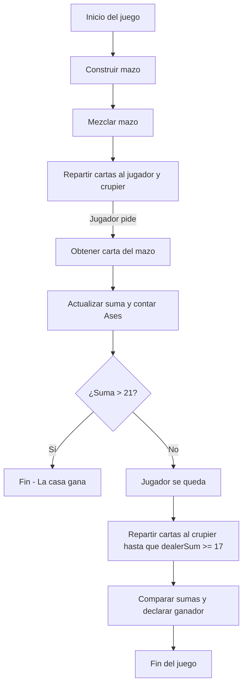

# Documentación: Juego de BlackJack en Java

## Introducción
Este documento proporciona una explicación detallada del código de un juego de BlackJack en Java. El objetivo es ayudar a los estudiantes a comprender los conceptos de Programación Orientada a Objetos (POO) y la implementación de una interfaz gráfica simple en Java.

## Glosario

- **Clase**: Plantilla que define los atributos y métodos comunes de los objetos de un tipo específico.
- **Objeto**: Instancia de una clase que representa una entidad en el programa.
- **Método**: Función definida dentro de una clase que opera sobre los datos de sus objetos.
- **Constructor**: Método especial que se llama automáticamente al crear un objeto para inicializarlo.
- **Encapsulación**: Principio de POO que oculta detalles internos de la clase y expone solo lo necesario.
- **Sobrecarga de métodos**: Permite definir varios métodos con el mismo nombre pero diferentes parámetros en una clase.
- **Interfaz gráfica de usuario (GUI)**: Componente visual que permite a los usuarios interactuar con el programa.

## Descripción del Código

### Paquete y Librerías Importadas

```java
package blackjack;

import java.awt.*;
import java.awt.event.*;
import java.util.ArrayList;
import java.util.Random;
import javax.swing.*;
```

El código está organizado dentro del paquete `blackjack` y utiliza varias bibliotecas estándar de Java para la interfaz gráfica y el manejo de eventos:

- **AWT**: Para la creación de la interfaz gráfica y el manejo de eventos.
- **Swing**: Para componentes de interfaz gráfica de usuario, como botones y paneles.
- **Util**: Contiene `ArrayList` para manejar listas dinámicas y `Random` para generar valores aleatorios.

### Clase Principal `App`

```java
package blackjack;

public class App {
    public static void main(String[] args) throws Exception {
        BlackJack blackjack = new BlackJack();
    }
}
```

La clase `App` contiene el método `main`, que es el punto de entrada de la aplicación. Al ejecutar `main`, se crea una instancia de la clase `BlackJack`, iniciando el juego.

### Clase `BlackJack`

Esta clase contiene la lógica completa del juego de BlackJack. Define varios atributos y métodos necesarios para gestionar la partida, el mazo de cartas, la mano del jugador y del crupier, y la interfaz gráfica.

### Clase Interna `Card`

```java
private class Card {
    String value;
    String type;

    Card(String value, String type) { ... }

    public String toString() { ... }
    public int getValue() { ... }
    public boolean isAce() { ... }
    public String getImagePath() { ... }
}
```

#### Descripción

La clase `Card` representa una carta individual en el juego, con los siguientes atributos y métodos:

- **Atributos**:
  - `value`: Valor de la carta (por ejemplo, "A", "2", "K").
  - `type`: Tipo de la carta (Corazones, Diamantes, Tréboles, Espadas representados como "C", "D", "H", "S").

- **Métodos**:
  - `toString()`: Sobrecarga para representar la carta como "valor-tipo".
  - `getValue()`: Devuelve el valor numérico de la carta (10 para "J", "Q", "K" y 11 para "A").
  - `isAce()`: Determina si la carta es un As.
  - `getImagePath()`: Genera la ruta de la imagen correspondiente a la carta.

### Atributos de la Clase `BlackJack`

- `deck`: `ArrayList<Card>` que almacena las cartas del mazo.
- `random`: Objeto de la clase `Random` para mezclar el mazo.
- `dealerHand`, `playerHand`: Listas de cartas en manos del crupier y del jugador.
- `dealerSum`, `playerSum`: Suma de las cartas del crupier y del jugador.
- `dealerAceCount`, `playerAceCount`: Cantidad de Ases en las manos del crupier y del jugador.
- `frame`, `gamePanel`, `buttonPanel`: Componentes de la interfaz gráfica para el juego.
- `hitButton`, `stayButton`: Botones para que el jugador decida pedir o quedarse.

### Constructor de la Clase `BlackJack`

```java
BlackJack() {
    // Inicialización del juego y configuración de la interfaz
    startGame();
    frame.setVisible(true);
    frame.setSize(boardWidth, boardHeight);
    frame.setLocationRelativeTo(null);
    frame.setResizable(false);
    frame.setDefaultCloseOperation(JFrame.EXIT_ON_CLOSE);

    gamePanel.setBackground(new Color(53, 101, 77));
    frame.add(gamePanel);

    hitButton.addActionListener(new ActionListener() { ... });
    stayButton.addActionListener(new ActionListener() { ... });
}
```

#### Descripción

El constructor configura la interfaz gráfica y los elementos necesarios, inicia el juego y asigna eventos a los botones para que el jugador pueda interactuar.

### Métodos de la Clase `BlackJack`

#### `startGame()`

Este método inicializa el juego, construye el mazo, lo mezcla y reparte cartas iniciales al jugador y al crupier.

#### `buildDeck()`

```java
public void buildDeck() {
    deck = new ArrayList<Card>();
    String[] types = {"C","D","H","S"};
    String[] values = {"A","2","3","4","5","6","7","8","9","10","J","Q","K"};

    for (String type : types) {
        for (String value : values) {
            deck.add(new Card(value, type));
        }
    }
}
```

Este método construye el mazo de cartas con las combinaciones de valores y tipos.

#### `shuffleDeck()`

```java
public void shuffleDeck() {
    for (int i = 0; i < deck.size(); i++) {
        int j = random.nextInt(deck.size());
        Card currCard = deck.get(i);
        deck.set(i, deck.get(j));
        deck.set(j, currCard);
    }
}
```

Este método baraja el mazo, intercambiando cartas en posiciones aleatorias.

#### `reducePlayerAce()` y `reduceDealerAce()`

Estos métodos ajustan la suma de puntos cuando el jugador o el crupier tiene un As y la suma supera 21, restando 10 a la suma total.

#### `paintComponent(Graphics g)`

```java
public void paintComponent(Graphics g) { ... }
```

Este método sobrescrito dibuja las cartas de las manos del jugador y del crupier en la interfaz. Utiliza imágenes de las cartas y muestra un mensaje final dependiendo del resultado de la partida.

---

## Diagrama de Flujo


